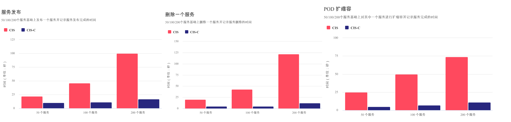

# F5 AS3 Template Generator

F5 AS3 Template Generator provide toolsets that generate configmap yaml, which used by automation ecosystem, like F5 CIS.

F5 AS3 Template Generator is written by Java, to use this tool you need Java/Maven installed in your computer and build from source code.

```
cd as3-perf-benchmark/ && mvn clean install
```

Once build success, a runnable fat jar `as3-perf-benchmark.jar` will come out, Run the fat jar with a configuration file `config.json`:

```
java -jar as3-perf-benchmark.jar config.json
```

which the `config.json` controls how the AS3 Template be geneated.

Below is a sample of a configuration file：

```
{
  "subnet": "197.20.222.0/24",
  "memberSubnet": "10.10.20.0/24",
  "mode": "CIS_291_AS_336_HUB",
  "as3Version": "3.36.0",
  "appCount": 5,
  "appPerNamespace": 2,
  "appImage": "artifactory.dev.example.cn:31345/net-docker-ver-local/bigip-ctlr/f5-demo-app:0221",
  "appImageContainerPort": 80,
  "namespacePrefix": "bigip-ctlr-ns-",
  "isNSPrecreated": true,
  "deployFile": "deploy.yaml",
  "configmapFile": "cm.yaml"
}
```

* subnet - the VS IP address range, which used by AS3 Service_HTTP, Service_L4, Service_TCP
* memberSubnet - The IP range used by AS3 Pool, note that if you geneate the Template for K8S CIS, this option is not needed, due the CIS will auto dicover the member addreee
* mode - used to specify the mode used to generate AS3 Template, Support value are: `AS_318`, `CIS_280_AS_330_HUB`, `CIS_281_AS_330_HUB`, `CIS_20_AS_318_HUB`, `CIS_21_NAMESPACE_LABEL`, `CIS_291_AS_336_HUB
* as3Version - specify AS Version, current support: `3.18.0`, `3.19.0`, `3.20.0`, `3.21.0`, `3.22.0`, `3.23.0`, `3.24.0`, `3.25.0`, `3.30.0`, `3.36.0`
* appCount - the number of total application
* appPerNamespace - the number of application per K8S namespace, only used in Cloud Native CIS 
* appImage - the application docker iamge, only used in Cloud Native CIS 

For more information refer to https://github.com/cloudadc/as3-configmap-generator

## Usage Case: CIS Auto Ops

Once the the Generator the Template, use K8S API can load the configmap style Template to K8S, then trigger CIS service post, which this can be used in CIS Auto Ops, https://github.com/cloudadc/as3-configmap-generator/blob/master/kubernetes-loader is a sample for this, which use K8S API via K8S Java SDK

```
        <dependency>
            <groupId>io.kubernetes</groupId>
            <artifactId>client-java</artifactId>
            <version>${io.kubernetes.version}</version>
        </dependency>
        <dependency>
            <groupId>io.kubernetes</groupId>
            <artifactId>client-java-extended</artifactId>
            <version>${io.kubernetes.version}</version>
        </dependency>
``` 

## Usage Case: CIS Control Plane Performance Benchmark

With AS3 Template Generator can generate K8S Deployment, and AS3 Configmap, eg, genetate 150 application, 10 application per namespace, then use the following commands can count the time spend for add 150 services, the time of delete/add one service, the time of POD scale.

```
kubectl apply -f configmap-filter-tenants/deploy-150-svc.yaml
kubectl apply -f configmap-filter-tenants/cm-150-svc.yaml

// add 151th app and 151th vs and record time spended
kubectl apply -f configmap-filter-tenants/deploy-151-svc.yaml
kubectl apply -f configmap-filter-tenants/cm-151-svc.yaml

// upadate service, then record time
kubectl scale -n cistest149 deploy/app-3 --replicas=2

// delete service from BIG-IP, record time
kubectl apply -f configmap-filter-tenants/cm-150-svc.yaml

// resource release
kubectl scale -n cistest149 deploy/app-3 --replicas=1
```

The Bash scripts can used to count the time:

```
STARTTIME=$(date +%s) ; for i in {1..100} ; do tmsh list ltm pool /perftest151/perftest151/* | grep address | wc -l ; ENDTIME=$(date +%s); echo "spend $(($ENDTIME - $STARTTIME)) seconds" ; sleep 3 ; done
```

The folloing is a results for use AS3 Template Generator to compare the control plane performance of CIS and CIS-C.



As above figures, the CIS-C has around 90% performance improvement.

* More about CIS-C refer to https://xc.f5se.io/projects/cis-c/
* More about complete steps of Performance Comparision refer to https://github.com/cloudadc/cis-scripts/blob/cis-hub/PERFORMANCE.adoc
