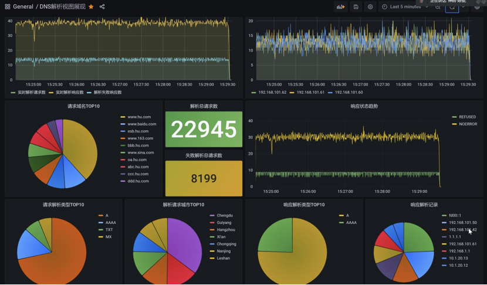
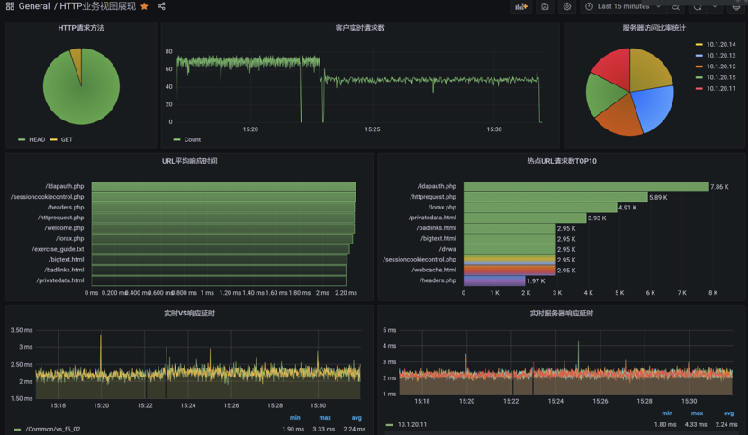
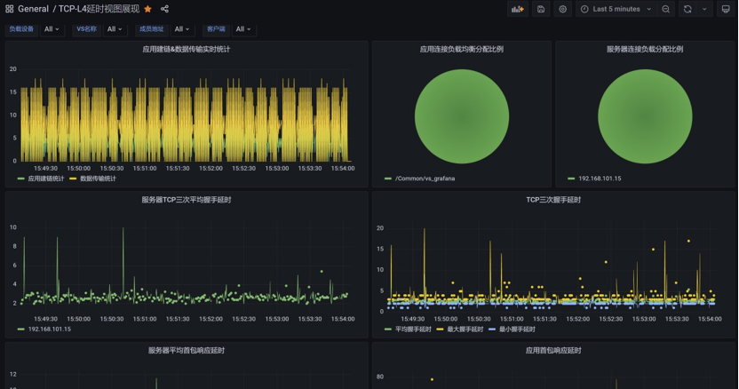
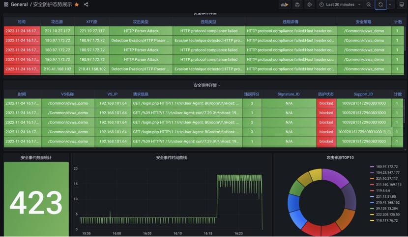
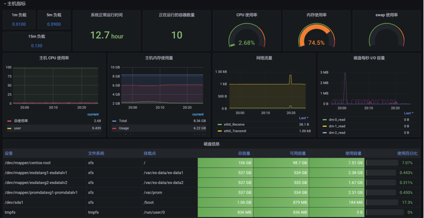
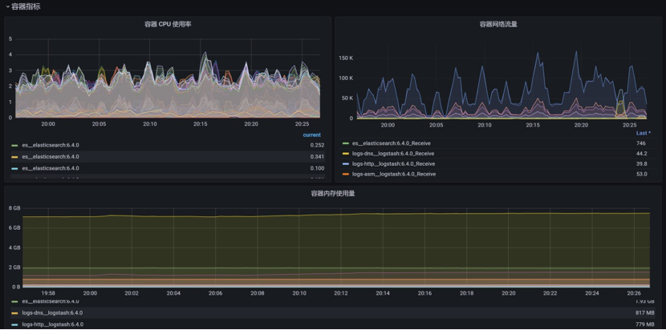

This is a brand new visualization powered by **Hu** Yipeng (胡易鹏) .

By combining Prometheus+Elasticsearch+Grafana to build a large screen for displaying F5 device status and business operation status.

- Prometheus combined with snmp-exporter is used to monitor the running status of equipment
- Elasticsearch combined with F5 HSL to display business operation status
- Grafana is used for large-screen view display

In word under this directory, you can see complete and detailed installation and configuration steps. related display

| **Dashboard template name**                | **Grafana data source** | **Function**                                            |
| ------------------------------------------ | ----------------------- | ------------------------------------------------------- |
| F5 equipment status monitoring             | Prometheus              | Monitor F5 device hardware status                       |
| Container&Node performance monitoring      | Prometheus              | Monitor the host hardware status                        |
| HTTP business view display                 | Elasticsearch-http      | Show F5 HTTP business status                            |
| Display of DNS resolution view             | Elasticsearch-dns       | Demonstrate F5 DNS service status                       |
| TCP-L4 delay view display                  | Elasticsearch-tcp       | Demonstrate the status of F5 L4 business chain building |
| Security protection situation view display | Elasticsearch-asm       | Show F5 Awaf security protection posture                |

Visual display effect of DNS resolution:

HTTP access visualization effect:

TCP connection delay display effect:

Display effect of security protection situation:

Host indicator monitoring display effect:

Display effect of container monitoring indicators:

