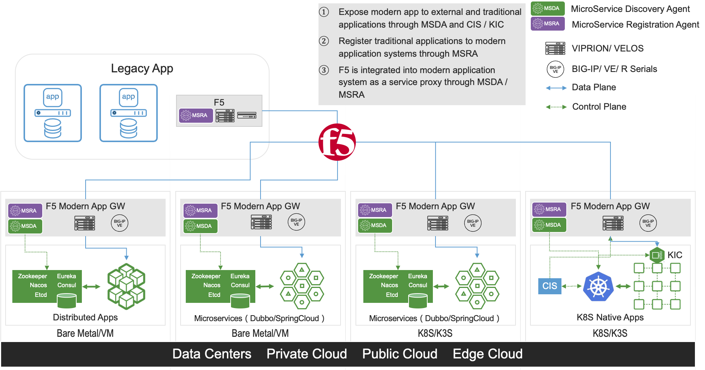

# Project MSDA (MicroService Discovery Agent), Bridge to Modern App.

A project to develop an agent(MSDA, MicroService Discovery Agent) for BIG-IP/NGINX to enable service discovery of distributed and Microservices applications.

Phase I: Develop iApps LX template and iControl LX API for BIG-IP
Phase II: Develop agent or module for NGINX
Phase III: Develop Containerized agent for VELOS

# Github Repo

[github repo, bridge2modernapp](https://github.com/orgs/ChinaModernAppGroup/teams/bridge2modernapp/repositories)

# A quick demo

[Demo repo, bridge2modernapp](https://github.com/ChinaModernAppGroup/MSDA-Demo)

