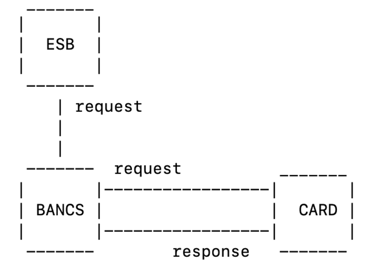
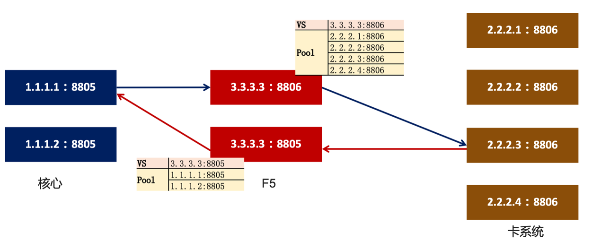

# About TTCP

TTCP(Test TCP) contains a series of tools used for testing TCP/UDP based connectivity and performance.

* *TTCP* is an utility to measure TCP throughput through an IP path, test tcp connection, transfers fabricated buffers or data copied from stdin. TTCP has long history, original created in 18 Dec 84 under 4.2BSD, later improved or modified by several professor/students/engineers/architects, what in this branch there has 3 key improvements: 1. add more options and a conf file `/etc/ttcp.conf` to adjust TCP profile in a fine-grained way; 2. recv side multiple processes ability, which the server side support multi-threads, not exit once a transaction finished; 3. cloud-native support, both recv and trans can run on K8S and Docker
* *BANCS* is a tool used to simplify BIG-IP MRF Generic Message Routing tesing, which with bancs tool, you can set up a BIG-IP MRF tesing environment in 5 – 10 minutes in your own laptop, with several VM instances and VE started.

Github repo: https://github.com/kylinsoong/ttcp 

# TTCP

TTCP(Test TCP) is an utility to measure TCP throughput through an IP path, test tcp connection, transfers fabricated buffers or data copied from stdin.

To use TTCP, start the receiver on one side of the path, then start the transmitter on the other side. The transmitting side sends a specified number of TCP packets to the receiving side. At the end of the test, the two sides display the number of bytes transmitted and the time elapsed for the packets to pass from one end to the other.

## How to Run TTCP

Install and run on traditional environment:

```
rpm -ivh ttcp-1.13-2.x86_64.rpm
ttcp -t [-options] host [ < in ]
ttcp -r [-options] [multicast-group][ > out]
```

Install and run on K8S:

```
kubectl apply -f ttcp.yaml
```

## TTCP Usage Case in Cloud Native Environment

TTCP for K8S performance benchmark results:


* Pods on same hosts have more than *1.6 times* TPS of pods across hosts in East-West traffic transmit.
* Pods on same hosts can approach *half of NIC* throughput in East-West traffic transmit.
* Pods on same hosts are *faster than* host to host East-West traffic transmit.
* *Hostnetwork* are the *fastest* way for North-South traffic transmit.
* *Hostnetwork* has the same performance as host to host, can approach *half of NIC* in North-South traffic transmit.
* *NodePort node local* mode have around *1.6 times* TPS of *NodePort node on cluster* mode North-South traffic transmit.
* *HostPort* has same performance as *NodePort node local* in North-South traffic transmit.
* *NodePort node on cluster* North-South has worst performance, than *ClusterIP pod across hosts* East-West.

# BANCS

## Why BANCS

Primary purpose of bancs tool is to simplify BIG-IP MRF tesing, which with bancs tool, you can set up a BIG-IP MRF tesing environment in 5 – 10 minutes in your own laptop, with several VM instances and VE started.

## What’s BANCS tool

The bancs tool is a simple tool for simulating Core Bank Systems, can run on common x86 systems, bancs tool has 4 modules:

* BANCS – Core system, which receive inbound message from ESB, and send and receive message with CARD.
* CARD – Card sysytem, which wait inbound message from BANCS, and send response message to BANCS
* ESB – ESB layer, send single or bunch of message to BANCS 
* TOOL – A tools, can generate ISO8583 compatible message



As the figure depicted above, a more detailed introduction as below:

1. BANCS listen on 9805, 8805, CARD listen on 8806, BANCS connect to CARD via 8806(mark as connection 1), CARD connect to BANCS via 8805(mark as connection 2)
2. A client simulate ESB send the request message to BANCS via 9805 which listened by BANCS
3. BANCS forward request message to CARD
4. CARD send response message to BANCS

## How to Install BANCS tool

To install bancs tool, first you need download a latest version from

https://github.com/kylinsoong/ttcp/releases

for example, you have downloaded the ttcp-1.13-2.x86_64.rpm from above link,  then you need prepare several x86 linux instances, on each instance install the rpm you just downloaded.

```
rpm -ivh ttcp-1.13-2.x86_64.rpm
```

After installation the commands hints can help to run, eg:

```
~]# bancs 
Usage: bancs -e [-options] <host of BANCS> 
       bancs -b [-options] <host of CARD>
       bancs -c [-options] <host of BANCS>
       bancs -t [-options]
Common options:
        -d      enable debug logging
        -l ##   the length of lay time of Init wait Listener (default 8 seconds, which means once Listener init finished and 8 * 10 seconds later, the Init start)
        -p ##   port number to send to or listen at (default 8805/8806 9805)
Common options for -t:
        -m ##   specify the version of the ISO8583 standard, allowed value are 0-9
        -n ##   total number of message to generated
        -k ##   specify message kinds, different kinds means different length, 1 - 1562

```

## How to Use BANCS tool

Below figure is a simple demonstration of running bancs tool, you need prepare linux instances(like centos) to run BANCS and CARD, and has BIG-IP set up IN and FROM VS.



As above figure depicted, five steps is necessary to set up a environment that contains BIG-IP and bancs modules(BANCS, CARD, ESB), BIG-IP sit between BANCS and CARD, provide genric message routing.

*Step 1: BIG-IP Configuration*

Create the MRF generaric message related objects, like peer, route, router, etc; create traditional BIG-IP objects, like Virtual Server, Pool, Monitor.

*Step 2: Start BANCS*

Run bancs with -b option to start the BANCS

```
bancs -b <IP of TO CARD VS>
```

*Step 3: Start CARD*

```
bancs -c <IP of FROM CARD VS>
```

*Step 4: Generate ISO 8583 Test Message*

Run bancs with -t and -n option to genrate test messages

```
bancs -t -n <the number of messages> > /etc/bancs.data
```

*Step 5: Start ESB to begain testing*

Run bancs with -e option to start the ESB

```
bancs -e <IP of one of BANCS>
```

